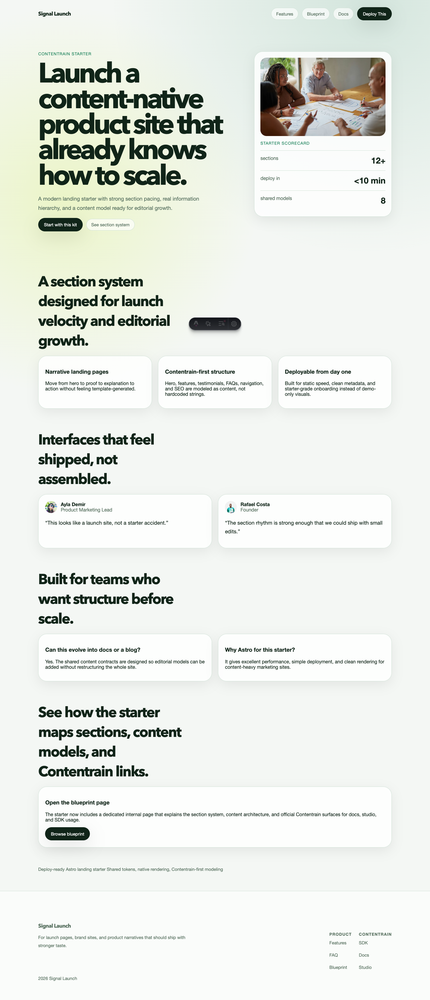
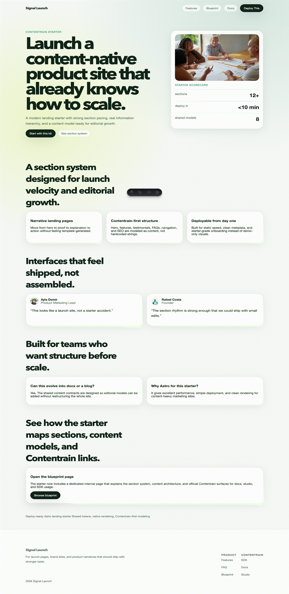

> Source of truth: this starter is exported from the `contentrain-starters` monorepo.
> Internal starter id: `astro-landing`.
# Contentrain Astro Landing

Narrative marketing starter for launches, brand sites, and product storytelling.





## Contentrain Ecosystem

- SDK and CLI: [ai.contentrain.io/packages/sdk.html](https://ai.contentrain.io/packages/sdk.html)
- Product guides: [docs.contentrain.io](https://docs.contentrain.io/)
- Content operations UI: [studio.contentrain.io](https://studio.contentrain.io)

## Quick Start

```bash
pnpm install
pnpm dev
```

## Commands

- `pnpm dev`
- `pnpm check`
- `pnpm build`
- `pnpm preview`
- `pnpm deploy:netlify`
- `pnpm contentrain:generate`

## Demo routes

- `/`
- `/blueprint`

## Contentrain

- Hero, stats, features, testimonials, FAQ, navigation, footer, and SEO live in `.contentrain/`
- Rendering uses the generated `#contentrain` SDK directly in Astro pages and layouts
- Seed content is committed so the starter is ready immediately after clone
- The starter includes a second internal route at `/blueprint` so it is not limited to a single-page hash demo
- The structure mirrors Contentrain’s content-first architecture: models, content, and runtime queries stay aligned inside the repo

## Deploy

- Netlify build command: `pnpm deploy:netlify`
- Netlify publish directory: `dist`
- `netlify.toml` is committed in the starter root

## Netlify Project Creation

[](https://app.netlify.com/start/deploy?repository=https%3A%2F%2Fgithub.com%2FContentrain%2Fcontentrain-starter-astro-landing)

Use `pnpm dlx netlify-cli init` to connect the repository for continuous deployment, or `pnpm dlx netlify-cli link` if the site already exists.
